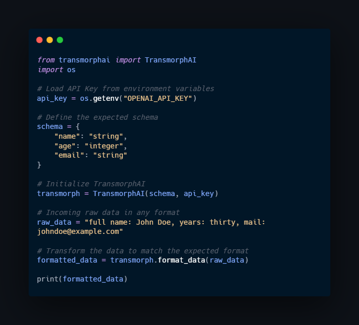

# 🚀 TransmorphAI - AI-Powered Data Transformation for APIs  

## 📌 Introduction  

API integrations can feel like **a never-ending struggle**. Every time you need to connect a system to an API, you face the same **frustrating** and **time-consuming** obstacles:  

❌ **Sifting through pages of API documentation** to figure out the exact data structure.  
❌ **Spending hours adapting request formats** to match strict requirements.  
❌ **Endless debugging, meetings, and testing cycles** just to get data to work correctly.  

💡 **But what if APIs could instantly understand and process any input, without the need for strict formatting?**  

That’s exactly why I created **TransmorphAI**—a **revolutionary Python library** that eliminates API integration headaches by using **AI-powered data transformation**.  

Now, **forget about data formatting constraints**. With **TransmorphAI**, you can **send data in any structure or format**, and it will be **automatically transformed** into the expected format—**no more endless debugging, no more wasted hours adjusting payloads**.  

🔹 **APIs should work for you—not the other way around.**  

### **🌍 The Future of API Integration Starts Now**  
Imagine a world where API consumers **no longer need to worry about how they format their data**. Instead of strict documentation and long testing cycles, all they need to know is **what parameters the API expects**—the format doesn’t matter anymore.  

✅ **You receive raw, unstructured data? TransmorphAI converts it.**  
✅ **Your API expects JSON but the client sends XML? No problem.**  
✅ **The names of the parameters are slightly different? AI understands them.**  
✅ **The data types are incorrect (e.g., `"30"` instead of `30`)? It’s fixed instantly.**  

This is not just a **tool**—this is **a paradigm shift** in how APIs communicate.

---

## **🔹 Why Use TransmorphAI?**  
TransmorphAI is designed to **make API integrations effortless**. Whether you're a developer, a product owner, or a CTO, it provides tangible benefits:  

✅ **📖 No More API Documentation Hassles** – Say goodbye to rigid formats! API consumers don’t need to strictly follow predefined structures anymore. Just send the data with the correct parameters, and TransmorphAI will take care of the rest.  

✅ **🔄 Works with Any Format** – JSON, XML, plain text… **it doesn’t matter!** The AI automatically understands and transforms the data.  

✅ **🌍 Cross-Language Parameter Recognition** – If your API expects `"nombre"` instead of `"name"`, **TransmorphAI will recognize and adapt automatically**.  

✅ **🔢 Smart Data Type Conversion** – Strings that should be numbers? Fixed. Lists that should be objects? Adjusted. **Everything formatted properly.**  

✅ **⚠️ Error Handling and Validation** – If required fields are missing, **TransmorphAI detects and alerts you immediately**, preventing unnecessary errors.  

✅ **🚀 Boosts Development Speed** – No more **weeks of debugging and meetings**. Just integrate once and forget about **tedious data adjustments**.  

✅ **💰 Saves Costs and Reduces Friction** – By reducing integration time and API-related debugging, **companies save money, developers save frustration, and products ship faster**.  

---

### **💡 The Bottom Line**  
APIs were created to **connect systems**, but formatting constraints **have slowed us down for years**.  
With **TransmorphAI**, API integration is finally evolving:  

🔹 **You send the data as it is.**  
🔹 **TransmorphAI adapts it automatically.**  
🔹 **The API processes it without issues.**  

No more manual conversions. No more painful debugging. **Just seamless automation.** 

---

## 🛠 How It Works
TransmorphAI allows developers to define the **expected schema**, and the AI automatically transforms incoming data to fit this schema. 

### **Example Scenario**
Imagine an API that requires the following **structured JSON**:
```json
{
  "full_name": "John Doe",
  "age": 30,
  "email": "john.doe@example.com"
}
```
However, API consumers may send data in various formats:

✅ **As JSON (incorrect format)**
```json
{
  "name": "John Doe",
  "years": "30",
  "mail": "john.doe@example.com"
}
```
✅ **As XML**
```xml
<user>
  <name>John Doe</name>
  <years>30</years>
  <mail>john.doe@example.com</mail>
</user>
```
✅ **As Plain Text**
```
name: John Doe
years: 30
mail: john.doe@example.com
```

🔹 **TransmorphAI automatically converts all these formats into the required JSON format:**
```json
{
  "full_name": "John Doe",
  "age": 30,
  "email": "john.doe@example.com"
}
```

Now, API consumers **don’t have to worry about formatting their requests**—they send the data in **any way they want**, and TransmorphAI **takes care of the rest**.

---

## 📸 Implementation Example



---

## 📌 Installation

You can install **TransmorphAI** directly from PyPI:
```bash
pip install transmorphai
```
Or clone the repository and install manually:
```bash
git clone https://github.com/gimenomarc/TransmorphAI.git
cd TransmorphAI
pip install -e .
```

---

## 📜 License
**MIT License** - Free to use and modify.

---

## 📞 Contact
💻 **GitHub Repo:** [TransmorphAI](https://github.com/gimenomarc/TransmorphAI)  
📍 **PyPI Package:** [TransmorphAI on PyPI](https://pypi.org/project/transmorphai/)  
📢 **Let’s discuss automation and AI-powered data transformation!** 🚀  

---

#APIs #Automation #DataTransformation #AI #Python

